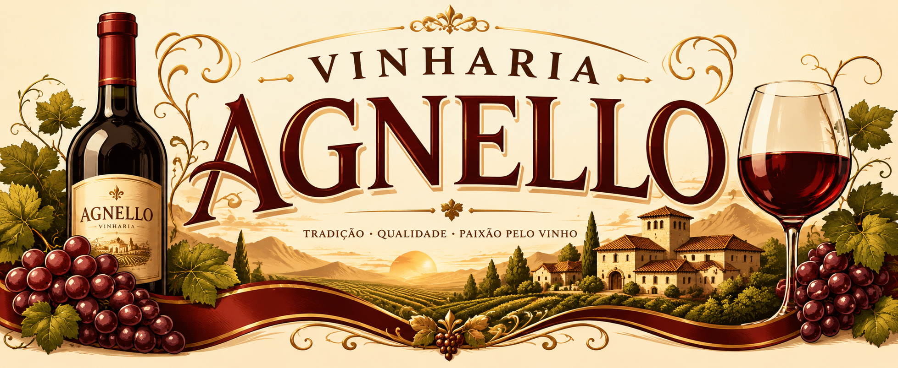

  

  

# 🍷 Vinheria Agnello - Sistema de Avaliação de Estoque e Tendência de Vinhos

# 📖 Descrição do Projeto
 Bem-vindo ao sistema inteligente da Vinheria Agnello!

Imagine um sommelier digital que ajuda a gerenciar sua adega. Este sistema foi criado para facilitar a vida dos funcionários da vinheria, permitindo que eles cadastrem vinhos, verifiquem automaticamente quais estão com estoque baixo e descubram quais são as preciosidades mais antigas da casa - tudo isso de forma simples e intuitiva.

# 🎯 Objetivo

Criar uma aplicação web que permita o cadastro sequencial de vinhos, realize validações automáticas e forneça análises sobre o estoque, safra e classificação de cada vinho cadastrado.

# 🛠️ Tecnologias Utilizadas

- JavaScript
- Git
- GitHub
- HTML
- CSS
- Console do navegador

# 👥 Partipantes

| Nomes         | RM             |
| :-------------| :------------: |
| Felipe Rabelo |  570340
| Gustavo Ferreira Tavares | 569928 |
| Ricardo Salmerón | 572916 |

# 🔗 Acesso ao Projeto
- Repositório GitHub : 
- Github Pages :

#
*"Feito com alma de sommelier e mente de desenvolvedor."*